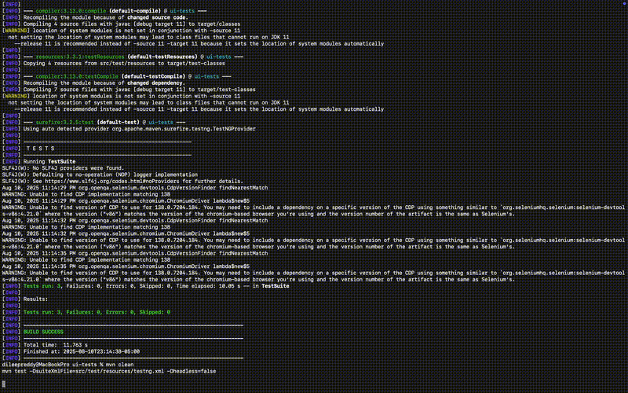

# Finance Credit Union – Online Banking QA

End-to-end QA project covering **Web UI**, **REST API**, and **Database Validation** for a fictional credit union’s online banking platform.  
Designed as a portfolio project to showcase real-world automation frameworks, API testing, SQL validations, and CI/CD pipelines.

---

## Key Features
- **POM-based Selenium framework** with TestNG suites (parallel-ready, data-driven)
- **API automation** with Postman collection + Newman CLI
- **Optional REST Assured** smoke test
- **SQL validation scripts** for balances, transactions, and loan applications
- **CI/CD integration** with GitHub Actions and Jenkins
- **Detailed documentation**: Test Plan, RTM, QA Summary, and Defect Log

---

## Modules Covered
1. **Authentication & Security** – login, logout, lockout
2. **Accounts** – balances, transactions, statements
3. **Transfers** – internal/external, limits
4. **Loans** – application, eligibility, status
5. **Bill Pay** – add biller, schedule, cancel payments

---

## Evidence: Test Run Previews

### **UI Test Run**


### **API Test Run**


---

## Screenshots (Assertions & Validations)

| Test Name                      | Screenshot |
|--------------------------------|------------|
| **Valid Login**                |  |
| **Invalid Login**              |  |
| **Transfer – After Submit**    |  |
| **Transfer – Dashboard Loaded**|   |
| **Transfer – Page Loaded**     |  |

---

## Reports
- **[UI Automation Report](docs/reports/ui-automation-report.html)** – Detailed Selenium TestNG run  
- **[API Newman Report](docs/reports/newman-report.html)** – API regression execution summary *(Move your `newman-report.html` here for link to work)*  
- **[REST Assured Report](docs/reports/rest-assured-report.html)** – Optional API smoke run

---

## How to Run (UI Automation)
```bash
cd ui-tests
mvn -q -DskipTests=false test -DsuiteXmlFile=src/test/resources/testng.xml
# Headless
mvn -q test -DsuiteXmlFile=src/test/resources/testng.xml -Dheadless=true
```

##  How to Run (API via Newman)
```bash
cd api-tests/postman
newman run finance-credit-union.postman_collection.json \
  -e environments/local.postman_environment.json
```

##  REST Assured Sample 
```bash
cd ui-tests
mvn -q -Dtest=ApiSmokeTest test
```

##  CI/CD
GitHub Actions Workflow: .github/workflows/ci.yml
Jenkins Pipeline: Jenkinsfile

##  Folder Structure
finance-credit-union-qa/
  ui-tests/
    screenshots/
  api-tests/postman/
  sql/
  docs/
    test-runs/
    reports/
  .github/workflows/


Author: Dileep Reddy Vyuyyuru
Email: vyuyyurudileepreddy@gmail.com

